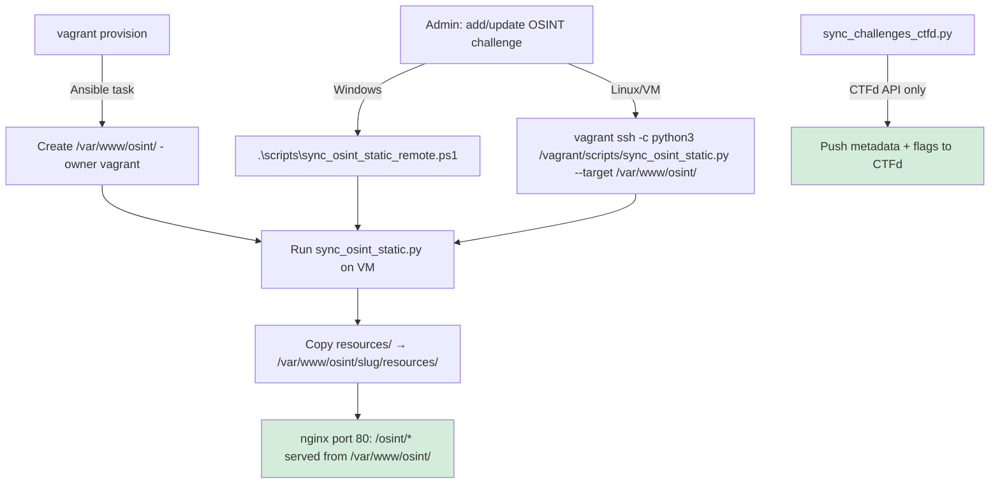
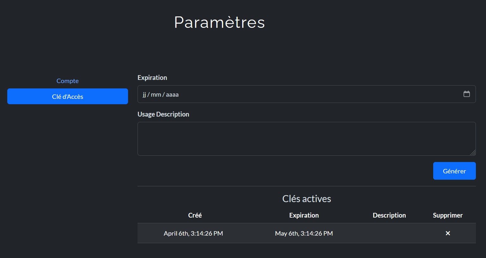

# CTFd Challenge Sync (Git -> API)

This guide adds GitOps-style challenge publication to CTFd.

## Why this matters

You keep challenge source in Git (`challenge.yml`, Docker files, flags), then publish to CTFd automatically via API.

Benefits:
- No repetitive manual form filling in CTFd admin UI
- Idempotent update flow (create/update)
- Challenges can be published as `visible` directly
- Admin panel remains useful for review/override only

## Scope and security stance

- Player self-registration remains **OFF** by default (recommended for event control).
- This sync script requires an **admin API token** from CTFd.
- It updates challenge metadata and static flags in CTFd.

## Script

- Script: `scripts/sync_challenges_ctfd.py`
- Default source: `challenges/`
- Excludes templates/folders prefixed with `_`


## OSINT static challenge: automatic link handling

For OSINT static challenges (category: `osint`, type: `static`):

- The `connection_info` field is automatically set to the static URL: `http://192.168.56.10/osint/<challenge-slug>/resources/`.
- Any link of the form `http://...:PORT` found in the `description` field is automatically replaced by the correct static URL before publishing to CTFd.
- This ensures that both the challenge card and the player instructions always display the correct access link, even if the YAML or README contained an old port-based link.
- This logic is handled by the sync script (`sync_challenges_ctfd.py`) and applies to both new and existing challenges.

**Example:**

If your `challenge.yml` contains:

```yaml
description: |
  1. Accède à la page du challenge :
    http://192.168.56.10:5012
  2. ...
```

After sync, the CTFd card will show:

```text
1. Accède à la page du challenge :
  http://192.168.56.10/osint/metro-memory-trail/resources/
2. ...
```

This is fully automatic and requires no manual update.

---

## OSINT static deployment architecture

Les fichiers statiques OSINT sont gérés séparément du sync CTFd API. Deux déclencheurs :



**Séparation des responsabilités :**
- `sync_challenges_ctfd.py` → push vers l'API CTFd uniquement (métadonnées, flags)
- `sync_osint_static.py` → copie des fichiers statiques vers `/var/www/osint/`
- Ansible → gère nginx et crée `/var/www/osint/` au provisioning

## What is synced

From each `challenge.yml`:
- `name`
- `category`
- `value`
- `description`
- `port` (optional)

Flag source priority:
1. `flag` field in `challenge.yml`
2. first line of `flag.txt`

CTFd mapping:
- challenge `type`: `standard`
- challenge `state`: default `visible` (override with `--state hidden`)
- `connection_info` default: one-click launch URL (`/plugins/orchestrator/launch?challenge=...`)
- optional admin UI mode: `--connection-mode orchestrator-ui`
- optional direct mode: `<instance-base-url>:<port>` with `--connection-mode static-port`

## Get CTFd API token

From CTFd admin account, create a token in profile/settings (token with challenge management scope).



Token safety rules:
- Treat the token like a password: never paste it in public chats, screenshots, issues, or commits.
- Prefer temporary shell environment variables over hardcoding in scripts.
- For team/shared environments, store it in a secret manager (for example Ansible Vault or CI secret store).
- If a token may be compromised, revoke/regenerate it immediately in CTFd and re-run your sync with the new token.

Example (PowerShell):

```powershell
$env:CTFD_API_TOKEN = "<YOUR_ADMIN_TOKEN>"
python scripts/sync_challenges_ctfd.py --ctfd-url http://192.168.56.10 --api-token $env:CTFD_API_TOKEN --dry-run
```

Example (bash):

```bash
export CTFD_API_TOKEN="<YOUR_ADMIN_TOKEN>"
python scripts/sync_challenges_ctfd.py --ctfd-url http://192.168.56.10 --api-token "$CTFD_API_TOKEN" --dry-run
```

## Quick start


### 1. Dry run

#### Bash
```bash
python scripts/sync_challenges_ctfd.py \
  --ctfd-url http://192.168.56.10 \
  --api-token <YOUR_ADMIN_TOKEN> \
  --dry-run
```

#### PowerShell
```powershell
python scripts/sync_challenges_ctfd.py `
  --ctfd-url http://192.168.56.10 `
  --api-token <YOUR_ADMIN_TOKEN> `
  --dry-run
```


### 2. Real sync (visible)

#### Bash
```bash
python scripts/sync_challenges_ctfd.py \
  --ctfd-url http://192.168.56.10 \
  --api-token <YOUR_ADMIN_TOKEN> \
  --state visible \
  --instance-base-url http://192.168.56.10
```

#### PowerShell
```powershell
python scripts/sync_challenges_ctfd.py `
  --ctfd-url http://192.168.56.10 `
  --api-token <YOUR_ADMIN_TOKEN> `
  --state visible `
  --instance-base-url http://192.168.56.10
```


### 3. Keep hidden for review

#### Bash
```bash
python scripts/sync_challenges_ctfd.py \
  --ctfd-url http://192.168.56.10 \
  --api-token <YOUR_ADMIN_TOKEN> \
  --state hidden
```

#### PowerShell
```powershell
python scripts/sync_challenges_ctfd.py `
  --ctfd-url http://192.168.56.10 `
  --api-token <YOUR_ADMIN_TOKEN> `
  --state hidden
```


### 4. Optional: admin UI links instead of one-click launch

#### Bash
```bash
python scripts/sync_challenges_ctfd.py \
  --ctfd-url http://192.168.56.10 \
  --api-token <YOUR_ADMIN_TOKEN> \
  --state visible \
  --connection-mode orchestrator-ui \
  --orchestrator-ui-url http://192.168.56.10/plugins/orchestrator/ui
```

#### PowerShell
```powershell
python scripts/sync_challenges_ctfd.py `
  --ctfd-url http://192.168.56.10 `
  --api-token <YOUR_ADMIN_TOKEN> `
  --state visible `
  --connection-mode orchestrator-ui `
  --orchestrator-ui-url http://192.168.56.10/plugins/orchestrator/ui
```


### 5. Optional: static direct links (`ip:port`)

Use this only if your challenge containers are permanently up on fixed ports.

#### Bash
```bash
python scripts/sync_challenges_ctfd.py \
  --ctfd-url http://192.168.56.10 \
  --api-token <YOUR_ADMIN_TOKEN> \
  --state visible \
  --connection-mode static-port \
  --instance-base-url http://192.168.56.10
```

#### PowerShell
```powershell
python scripts/sync_challenges_ctfd.py `
  --ctfd-url http://192.168.56.10 `
  --api-token <YOUR_ADMIN_TOKEN> `
  --state visible `
  --connection-mode static-port `
  --instance-base-url http://192.168.56.10
```

## Deployment Modes

### A) Automatic Deployment (Recommended)

For this repository, the default challenge publication flow is:
1. Create/update challenge files in Git.
2. Validate locally (`validate-challenge` script).
3. Open PR and let CI validate structure/tests.
4. Run sync script to publish/update in CTFd.

### B) Manual Deployment (Fallback Only)

Manual challenge creation in the CTFd admin UI is kept for debug/demo/one-off actions only.
Use it as an exception, not as the standard publication path.

## Environment variables (optional)

```bash
export CTFD_URL=http://192.168.56.10
export CTFD_API_TOKEN=<YOUR_ADMIN_TOKEN>
export CTFD_INSTANCE_BASE_URL=http://192.168.56.10

python scripts/sync_challenges_ctfd.py --dry-run
python scripts/sync_challenges_ctfd.py --state visible
```

## Admin workflow after sync

Recommended:
1. Run sync script from Git
2. Check challenge cards in CTFd UI
3. Override only if needed (special hints/files/rules)
4. Keep Git as source of truth for next sync

## Notes

- If a challenge already exists by name, script updates it.
- Script upserts one canonical static flag per challenge.
- If API token is invalid/missing, script exits with explicit error.
- `points` key is supported as fallback when `value` is absent.
- `instance.ports` mappings like `"5000:5000"` are parsed when top-level `port` is missing.
- `/plugins/orchestrator/ui` is intended for admin/dev operations, while players should use one-click launch links in challenge connection info.

## Troubleshooting

### 401/403 from API

- Token missing or insufficient privileges.
- Verify token and admin rights.

### Challenge created but not visible

- Ensure `--state visible` is used.
- Confirm CTFd UI filters are not hiding challenge category.

### Connection info missing

- Add `port` in `challenge.yml`.
- Pass `--instance-base-url`.
