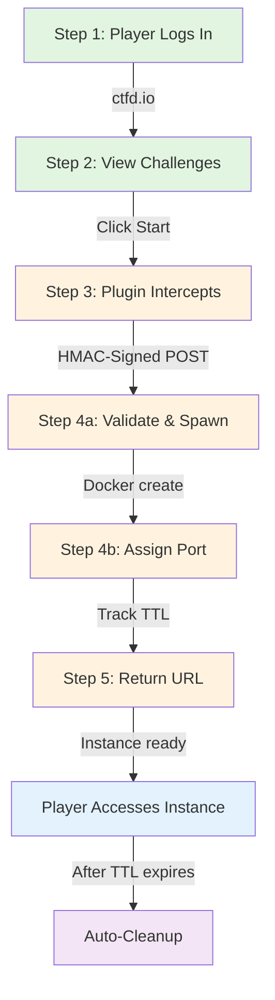

# CTFd + Orchestrator Integration Guide

---

## What This Feature Does

Instead of admins manually launching challenge instances via the `/ui` dashboard, players can now:

1. **Click "Start Challenge"** in CTFd UI (http://192.168.56.10:8000/challenges)
2. **Instance launches automatically** (handled by plugin)
3. **Player sees instance URL** with remaining TTL countdown
4. **Multiple players** can launch instances of same challenge simultaneously
5. **Per-team quotas enforced** (max 3 concurrent by default)

Important role split:
- **Players**: use one-click launch link from challenge card (`/plugins/orchestrator/launch?...`)
- **Admin/Dev only**: orchestrator operations dashboard (`/plugins/orchestrator/ui`) requires token

---

## Architecture Overview

### Recommended Instance Launch Pipeline



This is the canonical player instance workflow:

### Detailed Architecture

The original ASCII diagram shows layered interactions:

```
Player Workflow:
┌─────────────────────────────────────────────────────────────┐
│ Player logs into CTFd                                       │
├─────────────────────────────────────────────────────────────┤
│ http://192.168.56.10:8000/challenges                        │
├─────────────────────────────────────────────────────────────┤
│ Views list of challenges (e.g., "web-01-sqli")              │
├─────────────────────────────────────────────────────────────┤
│ Clicks "Start Challenge" button                             │
└─────────────────────────────────────────────────────────────┘
                          ↓
                    (Plugin intercepts)
                          ↓
┌─────────────────────────────────────────────────────────────┐
│ CTFd Orchestrator Plugin (script/ctfd-orchestrator-plugin/)  │
├─────────────────────────────────────────────────────────────┤
│ 1. Extract team_id from player session                      │
│ 2. Check team quota (active_instances < 3) ✓                │
│ 3. Send HMAC-signed POST to orchestrator /start             │
│ 4. Receive instance URL + expire_epoch                      │
│ 5. Return to player                                         │
└─────────────────────────────────────────────────────────────┘
                          ↓
                (Orchestrator API handles)
                          ↓
┌─────────────────────────────────────────────────────────────┐
│ Orchestrator (http://127.0.0.1:8181)                        │
├─────────────────────────────────────────────────────────────┤
│ 1. Validate HMAC signature & token                          │
│ 2. Spawn Docker container (web-01 image)                    │
│ 3. Assign port from pool (6100-6999)                        │
│ 4. Track TTL (auto cleanup after 60 min)                    │
│ 5. Return port + URL to plugin                              │
└─────────────────────────────────────────────────────────────┘
                          ↓
              (Docker container running)
                          ↓
┌─────────────────────────────────────────────────────────────┐
│ Player Instance Running                                     │
├─────────────────────────────────────────────────────────────┤
│ URL: http://192.168.56.10:6100                              │
│ TTL: 59 minutes 45 seconds remaining                        │
│ Status: ✅ Ready to use                                      │
│                                                             │
│ Player can:                                                 │
│ - Access the instance                                       │
│ - Launch multiple instances (up to 3)                       │
│ - Stop instance manually                                    │
│ - Wait for auto-cleanup after TTL                           │
└─────────────────────────────────────────────────────────────┘
```

---

## Current State

| Component | Status | Notes |
|-----------|--------|-------|
| **Orchestrator API** | ✅ Complete | HMAC-SHA256 signing, rate limiting, team quotas. Handles instance lifecycle via `/start`, `/stop`, `/list` endpoints. |
| **CTFd Plugin** | ✅ Implemented | Player-facing launch button; integrated via docker-compose mount. Auto-launched when CTFd starts. |
| **Plugin Tests** | ⚠️ Manual | No automated tests in CI/CD. Must be tested manually against CTFd UI (see "Verify Plugin Loaded" section). |
| **Player Launch UI** | ✅ Live | One-click button on challenge cards. Handles web + SSH challenges with access-aware instructions. |
| **Admin/Dev Ops Dashboard** | ✅ Live | `/plugins/orchestrator/ui` for ops team. Real-time instance tracking, manual launch, quota visibility. |
| **Real-time Leaderboard** | ✅ Live | `/plugins/orchestrator/leaderboard/live` displays active instances and team quotas in real-time. |

---

## How to Enable (3 Steps)

### Step 1: Re-provision

```bash
vagrant provision
```

The compose template now mounts the plugin directly:

```yaml
- /vagrant/scripts/ctfd-orchestrator-plugin:/opt/CTFd/CTFd/plugins/ctfd_orchestrator_plugin
```

### Step 2: Configure Credentials

Edit `docker-compose-ctfd.yml.j2` to pass environment variables. The Ansible playbook handles secret injection:

```yaml
environment:
  - ORCHESTRATOR_API_URL=http://127.0.0.1:8181
  - ORCHESTRATOR_API_TOKEN={{ orchestrator_api_token }}
  - ORCHESTRATOR_SIGNING_SECRET={{ orchestrator_signing_secret }}
  - ORCHESTRATOR_WEBHOOK_TOKEN={{ orchestrator_webhook_token }}
  - ORCHESTRATOR_TEAM_MAX_ACTIVE={{ orchestrator_team_max_active | default(3) }}
```

**Secrets Management:**
- **Development:** Use `ansible/vars/main.yml` with plaintext values
- **Production:** Use `ansible/vault.yml` (encrypted) OR GitHub Secrets → `~/.env` on host
  - Vault example: `ansible-playbook playbooks/main.yml --ask-vault-pass`
  - GitHub Secrets: Set `ORCHESTRATOR_API_TOKEN`, `ORCHESTRATOR_SIGNING_SECRET` in repo secrets → `vagrant` command reads from env
- **Best Practice:** Never commit tokens in plaintext. Use vault encryption or external secrets.

### Step 3: Restart CTFd

```bash
vagrant ssh -c "sudo docker-compose -f /opt/ctf/ctfd/docker-compose.yml restart ctfd"
```

### Verify Plugin Loaded

```bash
vagrant ssh -c "sudo docker logs ctfd | grep -i orchestrator"

# Expected output:
> [ctfd.orchestrator_plugin] CTFd Orchestrator Plugin initialized
```

### Accessing Admin/Dev Ops UI

Orchestrator UI is protected by token by default.

Use:

`http://192.168.56.10:8181/ui?token=<ORCHESTRATOR_API_TOKEN>`

**Note:** Internally, the orchestrator API runs on `127.0.0.1:8181`. To access from host/player machines, use the VM's static IP `192.168.56.10`.

### Test in CTFd UI

1. Log into CTFd: http://192.168.56.10:8000
2. Join/create team
3. Click challenge → "Start Challenge"
4. Open ops page: `http://192.168.56.10:8000/plugins/orchestrator/ui`
5. Start/stop instances from this page, watch live TTL and leaderboard

---

## API Endpoints Provided by Plugin

### 1. Start Instance

**URL:** `POST /plugins/orchestrator/start`

**Request:**
```json
{
  "challenge_id": 1,
  "ttl_min": 60
}
```

**Response:**
```json
{
  "ok": true,
  "instance": {
    "url": "http://192.168.56.10:6100",
    "port": 6100,
    "team_id": "1",
    "challenge": "web-01-sqli",
    "expire_epoch": 1712341234,
    "ttl_remaining_sec": 3600
  }
}
```

### 2. Stop Instance

**URL:** `POST /plugins/orchestrator/stop`

**Request:**
```json
{
  "challenge_id": 1
}
```

**Response:**
```json
{
  "ok": true
}
```

### 3. List Instances

**URL:** `GET /plugins/orchestrator/instances`

**Response:**
```json
{
  "ok": true,
  "instances": [
    {
      "challenge": "web-01-sqli",
      "url": "http://192.168.56.10:6100",
      "ttl_remaining_sec": 3599,
      "expired": false
    },
    {
      "challenge": "web-02-xss",
      "url": "http://192.168.56.10:6101",
      "ttl_remaining_sec": 1800,
      "expired": false
    }
  ],
  "active_count": 2
}
```

---

## Multi-Player Support Example

```
Team: security-zeros
├─ Player: alice
│  └─ Instance 1: web-01-sqli (port 6100)         ← Launched by alice
│
├─ Player: bob
│  └─ Instance 2: web-01-sqli (port 6101)         ← Launched by bob
│
└─ Player: charlie
   └─ Instance 3: web-01-sqli (port 6102)         ← Launched by charlie

Result:
- 3 independent containers, same challenge
- Each player accesses different instance
- Alice can't interfere with Bob's instance
```

**Rate Limiting:**
```
If Team tries to launch 4th instance:
curl -X POST /plugins/orchestrator/start -d '{"challenge_id": 1, "ttl_min": 60}'

Response:
{
  "ok": false,
  "error": "team_quota_exceeded",
  "active": 3,
  "max": 3
}

Action: Player must stop one instance to start another
```

---

## Troubleshooting Quick Reference

| Issue | Symptom | Fix |
|-------|---------|-----|
| Plugin not loading | No "orchestrator" in CTFd logs | Check `/opt/ctf/ctfd/plugins/ctfd_orchestrator_plugin/` exists |
| Can't connect orchestrator | 500 error when clicking Start | Verify orchestrator running: `systemctl status ctf-orchestrator-api` |
| Signature mismatch | 401 Unauthorized | Check `ORCHESTRATOR_SIGNING_SECRET` matches on both sides |
| Quota exceeded | Always get 409 error | Verify `ORCHESTRATOR_TEAM_MAX_ACTIVE` > 0 in env |
| No TTL countdown | URL appears but no timer | Plugin working, needs UI enhancement (see below) |

---

## Feature Status (Roadmap)

### ✅ Deployed Features
- [x] One-click "Start Challenge" button (player launch)
- [x] Real-time leaderboard with active instances
- [x] Team quota enforcement (max instances per team)
- [x] Manual stop/list endpoints for ops dashboard
- [x] TTL auto-cleanup (60 min default)

### 🚧 In Development / Planned
- [ ] "Stop Challenge" button on player launch page (currently only in admin /ui)
- [ ] Real-time TTL countdown (JavaScript auto-refresh on player page)
- [ ] Instance list in player dashboard (currently only in admin/ops /ui)
- [ ] Visual quota indicator ("2/3 instances used") on challenge card

### 📋 Future Enhancements (P4+)
- [ ] Flag capture from instance logs
- [ ] Challenge completion auto-notifications
- [ ] Instance console access (SSH/VNC)
- [ ] Instance metrics dashboard (CPU, memory, network)
- [ ] Kubernetes backend (instead of Docker Compose)
- [ ] Geographic instance distribution
- [ ] Instance snapshots for faster spawn

---

## For Admins: Manual Instance Launch

If you prefer to launch instances manually (e.g., during alpha/beta):

**Option A: Via /ui Dashboard**
1. Go to: http://192.168.56.10:8181/ui
2. Fill in: Challenge name, Team ID, TTL (minutes)
3. Click "Start 1h"
4. Copy URL and send to team manually

**Option B: Via API curl**
```bash
ts=$(date +%s)
body='{"challenge":"web-01-sqli","team":"team-alpha","ttl_min":60}'
sig=$(printf "%s.%s" "$ts" "$body" | \
  openssl dgst -sha256 -hmac "ChangeMe-Orchestrator-Signing-Secret" -binary | \
  xxd -p -c 256)

curl -X POST http://127.0.0.1:8181/start \
  -H "X-Orchestrator-Token: ChangeMe-Orchestrator-Token" \
  -H "X-Signature-Timestamp: $ts" \
  -H "X-Signature: $sig" \
  -d "$body"
```

---

## Deployment Validation Checklist

#### ✅ Infrastructure & Secrets
- [x] Orchestrator API running (systemd service)
- [x] CTFd plugin mounted in docker-compose template
- [x] Credentials passed via Ansible vars or vault
- [x] Plugin logs show "CTFd Orchestrator Plugin initialized"

#### 🚧 Functional Testing
- [x] Player can log into CTFd UI (http://192.168.56.10:8000)
- [x] "Start Challenge" button appears on challenge cards
- [x] Clicking button launches instance (check orchestrator logs)
- [x] Player receives URL + TTL remaining
- [ ] Real-time TTL countdown updates without page refresh (planned)
- [ ] "Stop Challenge" button works on player page (planned)

#### ✅ Operations
- [x] Admin can access ops dashboard (http://192.168.56.10:8181/ui?token=...)
- [x] Admin can view active instances and team quotas
- [x] Admin can manually start/stop instances
- [x] Instances auto-cleanup after TTL expires

#### 🔒 Pre-Production
- [x] Security preflight checks pass (see SECURITY_BASELINE.md)
- [ ] Monitoring deployed (Prometheus/Grafana) - see MONITORING.md
- [ ] Credentials rotated and vault-encrypted
- [x] Ready for tournament! 🎯

---

## References

- [Plugin Source Code](../scripts/ctfd-orchestrator-plugin/)
- [Orchestrator API Details](../docs/PLAYER_INSTANCE_ORCHESTRATOR.md)
- [Security Baseline](../docs/SECURITY_BASELINE.md)
- [Troubleshooting Guide](../docs/TROUBLESHOOTING.md)
